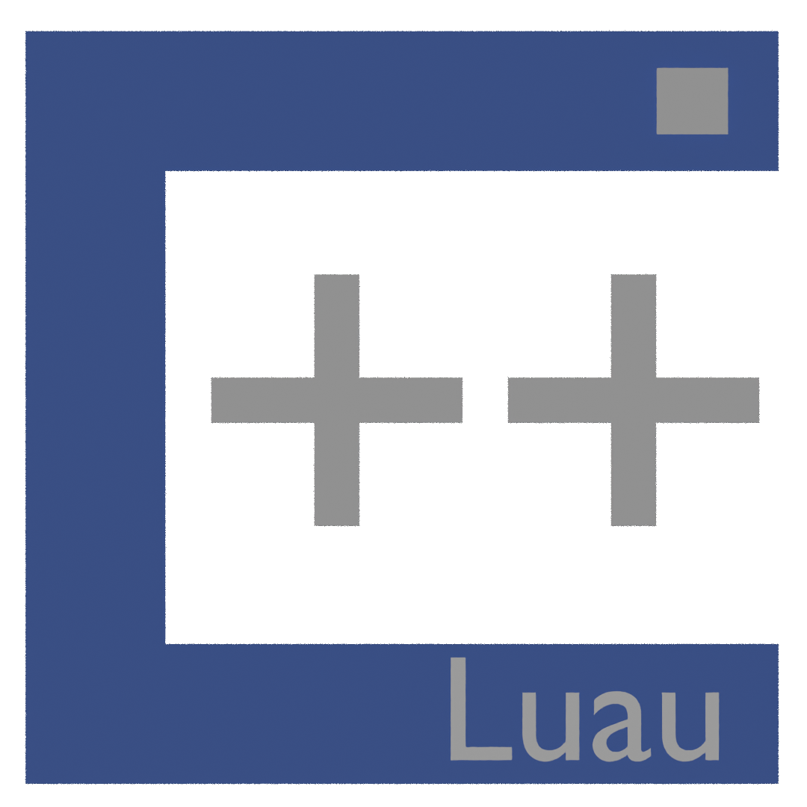

  

<h1 align="center">Luau++</h1>

  A Luau-inspired compatibility layer for C++

Luau++ is a Luau-inspired small library/compatibility layer for C++, where programmers can write Luau-like code with the main header.

(Disclaimer: Luau++ is an independent project and is not affiliated with, sponsored by, or endorsed by Roblox Corporation.)

(Fully written in C++)

Further informations will be given in the include, README.txt

Project Version: #4

I'll be releasing newer updates for the code.

@Cashierob
